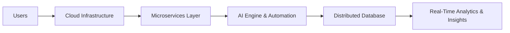

<!-- ========================================= -->
<!--        MISSARI | 2026 TREND README        -->
<!-- ========================================= -->

<h1 align="center">💡 Missari</h1>

<p align="center">
  <b>Co-Founder @ Daral AI</b> • <b>CTO @ Orange University LLC</b><br/>
  Software Architect • AI • Cloud • Distributed Systems
</p>

<p align="center">
  
</p>

---

## 🧠 About Me

<div align="center" style="backdrop-filter: blur(15px); background: rgba(0,0,0,0.3); padding: 20px; border-radius: 20px;">
  
```yaml
name: Missari
role: Software Architect & Tech Leader
company:
  - Co-Founder @ Daral AI
  - CTO @ Orange University LLC
focus:
  - Artificial Intelligence Systems
  - Cloud-Native Architecture
  - Distributed Computing
  - Scalable SaaS Platforms
mission: "Design systems that scale, adapt, and create real-world impact."
```

I design **high-performance, distributed systems** combining AI intelligence and cloud scalability.
</div>

---

## ⚡ Tech Stack

<p align="center">
  
</p>

---

## 🌐 Roles & Leadership

### 🔥 Co-Founder — Daral AI
> Building AI-driven platforms with distributed architecture & intelligent automation.

### 🎓 CTO — Orange University LLC
> Leading infrastructure strategy, product architecture, and scalable system engineering.

---

## 🏗 Architecture Philosophy

- 🌌 Scale-first design  
- 🧩 Modular & clean architecture  
- ⚡ Automation & CI/CD workflows  
- 🤖 AI-enhanced applications  
- 🔐 Secure & resilient systems  

> Systems should be **engineered intentionally**, not just built.

---

## 📊 GitHub Analytics

<p align="center">
  
  
</p>

<p align="center">
  
</p>

---

## 🤖 System Design & AI Focus



---

## 🌟 What I Build

- AI-powered SaaS platforms  
- Autonomous AI systems  
- Cloud-native distributed apps  
- Real-time high-performance systems  

---

## 📫 Connect & Collab

Open for discussions in:
- AI & LLM systems  
- Distributed systems & cloud infrastructure  
- Startup tech strategy  
- Scalable backend architecture  

<p align="center">
  
</p>
